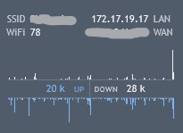

# A Rainmeter set of flat skins

## Skins

### Time

Based on Elementary Time

### Date

Based on Elementary Date

### Network

Based on Enigma Sidebar Network-Graph

### Weather

Based on Simplony Weather

#### Customization

In `FlatSkin/@Resources/Settings.ini` change the `Location` key to your location code.  
To get the location code use [weather.com](https://weather.com) website